A collection of all modules to see if they make it to a published sight

> [!note] Here is a callout

> [!warning] Warn Me
> callout warning with a title

==highlighted Text==, *italics*, **Bold**, ~~strike through~~, 

```leaflet
id: leaflet-map
image: [Pasted image 20221019213517](📁music/History/_attachments/Pasted%20image%2020221019213517.png)
height: 500px
lat: 50
long: 50
minZoom: 1
maxZoom: 10
defaultZoom: 8
unit: meters
scale: 1
marker: default, 39.983334, -82.983330, [[Note]]
darkMode: true
```



```mermaid
flowchart TB

%% Hardware
noteIds("notesId []")
userId("userId")


subgraph Your DB

	subgraph "User 👨‍🦲"
		id
		noteIds
	end
	
	subgraph "Note 📝"
		id
		userId <--> noteIds
	end
	
end
```

```dataview
TABLE dateformat(file.mtime, "dd.MM.yyyy - HH:mm") AS "Last modified"
FROM ""
SORT file.mtime DESC
LIMIT 3
```

## Visual Note link


## Headers

# This is a Heading h1
## This is a Heading h2
###### This is a Heading h6

## Emphasis

*This text will be italic*  
_This will also be italic_

**This text will be bold**  
__This will also be bold__

_You **can** combine them_

## Lists

### Unordered

* Item 1
* Item 2
* Item 2a
* Item 2b

### Ordered

1. Item 1
2. Item 2
3. Item 3
    1. Item 3a
    2. Item 3b

## Images


### Excalidraw

![[Excalidraw/DMX Enclosure Draft]]

## Links

You may be using [Markdown Live Preview](https://markdownlivepreview.com/).

## Blockquotes

> Markdown is a lightweight markup language with plain-text-formatting syntax, created in 2004 by John Gruber with Aaron Swartz.
>
>> Markdown is often used to format readme files, for writing messages in online discussion forums, and to create rich text using a plain text editor.

## Tables

| Left columns  | Right columns |
| ------------- |:-------------:|
| left foo      | right foo     |
| left bar      | right bar     |
| left baz      | right baz     |

## Blocks of code

```js
// javascript
let message = 'Hello world';
alert(message);
```

```html
<!-- html  -->
<p> my words are words words words </p>
```

```yml
name:
  work:
    - life
    - is
    - great
```

```bash
#!/bin/bash

# bash
SOURCE="/home/qinton/scripts"

cp $SOURCE ./
```
## Inline code

This web site is using `markedjs/marked`.