Here is my amateur opinion on choosing between a document database like [CouchDB](https://couchdb.apache.org/) or [MongoDB](https://www.mongodb.com/) vs a sequel database like [PostgreSQL](https://www.postgresql.org/) or [MariaDB](https://mariadb.org/) 

## Which one should I choose?

Is your data simple and the schema needs to be flexible? Choose a **Document DB**

Does your data have multiple relationships that link it together? Choose a **SQL DB**

__SQL__ 
- PRO: for data that you want to relate many times over in many different ways.
- CON: updating schemas can be a delicate process 

__DOCUMENT__:
- PRO: very quick to write and easy to understand. Also updating schema is a breeze
- CON: becomes very verbos when wanting to link different parts together. 

I'd say use document db if 
- A: you're a beginner, 
- B: the data is very simple and user specific, 
- C: prototyping a frontend app and want to save time

Use an SQL if 
- A: your data will have a multiple relationships, 
- B: You have strong confidence of the data's schema going in.

## I'm lost

If you've gotten this far and still don't know what I'm talking about, then just choose a **Document DB**. A lot of my beginner projects was built with [CouchDB](https://couchdb.apache.org/). It's easy to understand and fast to set up and update. 

Like most people, I created a note taking app. This was perfect for a **Document DB**. 

```mermaid
flowchart TB

%% Hardware
noteIds("notesId []")
userId("userId")


subgraph Your DB

	subgraph "User 👨‍🦲"
		id
		name
		email
		password
		noteIds
	end
	
	subgraph "Note 📝"
		id
		title
		list
		userId <--> noteIds
	end
	
end


```

You can see I 'link' the data points of `User` and `Note` with a `noteIds` and `userId`.

I use 'link' in quotes because when I query the **User** data, I'm only receiving an array of note `ids`, then I have to make another query to the notes and find the related ids.  As your db grows sooner or later you'll hit this wall of creating these *manual* links between data. 

